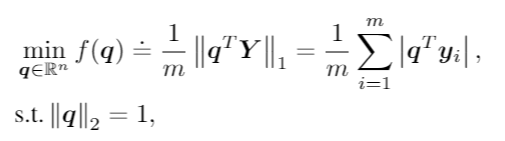

Spectral Radius Optimization
========

This example is based on Bai, Yu, Qijia Jiang, and Ju Sun. "Subgradient descent learns orthogonal dictionaries." arXiv preprint arXiv:1810.10702 (2018).

where q is a n by 1 vector, Y is a n by m matrix. m = 10*n^2.

In the given exampple, we set dimension n = 30.

runExample.py
-----------------

The required input for ``pygranso()`` is ``vars``, ``parameters`` (optional) and ``opts`` (optional)

1. ``vars``
   
   In the example, we set dimension::

      n = 30.
   
   ``vars`` is a python dictionary used for indicate variable name and corresponding matrix dimension. 
   Since ``q`` is a vector here, we set the dimension to ``(n,1)``::

      vars = {"q": (n,1)}

2. ``parameters``

   To save the computational sources, we recommend to generate all the required paramters in the ``runExample.py`` and 
   pass it to ``combinedFunction.py.`` through function ``pygranso()``.

   .. warning::
      All non-scalar parameters should be Pytorch tensor
   
   First initialize a structure for parameters::

      from pygransoStruct import Parameters
      parameters = Parameters()

   Then define the parameters::

      m = 10*n**2   # sample complexity
      theta = 0.3   # sparsity level
      Y = norm.ppf(np.random.rand(n,m)) * (norm.ppf(np.random.rand(n,m)) <= theta)  # Bernoulli-Gaussian model
      parameters.Y = torch.from_numpy(Y) 
      parameters.m = m

3. ``opts``

   User-provided options. First initialize a structure for options::

      from pygransoStruct import Options
      opts = Options()

   Then define the options::

      opts.QPsolver = 'osqp' 
      opts.maxit = 10000
      # User defined initialization. 
      np.random.seed(1)
      x0 = norm.ppf(np.random.rand(n,1))
      x0 /= la.norm(x0,2)
      opts.x0 = x0
      opts.opt_tol = 1e-6
      opts.fvalquit = 1e-6
      opts.print_level = 1
      opts.print_frequency = 10

   See :ref:`settings<Settings>` for more information.

After specify all three values (``parameters`` and ``opts`` are optional), call the main function::

   soln = pygranso(vars,parameters,opts)

combinedFunction.py
-----------------

The ``combinedFunction.py`` is used to generate user defined objection function ``f``, 
inequality constraint function ``ci`` and equality constraint function ``ce``.

Notice that we have auto-differentiation feature implemented, so the analytical gradients are not needed.

1. Obtain the (pytorch) tensor form gradients from structure ``X``. And require gradient for the autodiff::

      q = X.q
      q.requires_grad_(True)

2. Obtain parameters from ``runExample.py``::

      m = parameters.m
      Y = parameters.Y

3. Define objective function. Notice that we must use pytorch function::

      qtY = q.t() @ Y
      f = 1/m * torch.norm(qtY, p = 1)

4. Since no inequality constraint required in this problem, we set ``ci`` to ``None``::

      ci = None   

5. Define the equality constraint function. We must initialize ``ce`` as a struct, 
   then assign different as ``ce.c1``, ``ce.c2``, ``ce.c3``...::

      from pygransoStruct import general_struct
      ce = general_struct()
      ce.c1 = q.t() @ q - 1

6. Return user-defined results::

     return [f,ci,ce]